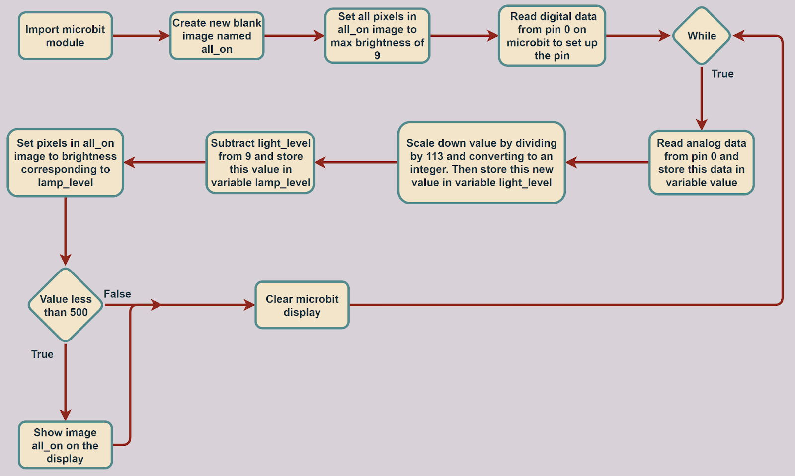

# Microbit_Night_Light
Lesson 10 of my Intro to Python course with Microbit

Program Overview: This program is a simple night light created using the microbit and python. It uses a photoresistor, connected to the microbit’s 0 and 3V pins with alligator wires, to measure the surrounding environment’s light level and adjust the brightness of the screen accordingly.

New Learnings: One new learning from this lesson involves reading data from the microbit’s pins. The functions pin0.read_analog() or pin0.read_digital() helps interpret the data being sent from the photoresistor to the microbit pins in python. The difference between analog and digital is the types of data they return. Digital, only returns 0 or 1, whereas analog returns an integer from 0 to 1024. In this program, the read_digital is only used to set up the pin for use later on in the code. The read_analog is the function that actually provides the data from the photoresistor required to adjust the brightness of the screen dynamically. Another new learning from this lesson is regarding images, for the microbit screen. The Image() function creates a fresh new blank image and this function plays a pivotal role in this program because it is the image being displayed by the microbit. Another new function, fill() is what performs the adjusting of the image’s brightness. The fill function takes an integer between 0 and 9 for a parameter and this value is the pixel's brightness, with 0 being off and 9 being maximum brightness.

Real-World Connections: One real-world application for this is in cars. Some cars have a feature with their headlights where they automatically turn on when it’s dark and also turn on the high-beam headlights when it’s appropriate. These cars probably work in a similar way to this program, in the sense that they take light level data from a light sensor position on the car. They then interpret this data and decide whether they should turn on their headlights or not. Furthermore, they may use various cameras positioned around the car to determine whether they should turn on their high-beam headlights or not, as the high beams may blind other drivers. The camera could constantly look for any cars and this data could be used in conjunction with light level data from the light sensor to dynamically turn on or off the headlights of the car.

Applications: One application for this type of program is in making phones. Most smartphones have a feature where they dynamically adjust the brightness of their screen based on the brightness of the environment around them, this serves multiple purposes, including saving power, decreasing eye strain, and is overall better for the phone’s lifespan. This feature is implemented in a similar way to this program, a light sensor on the phone takes light level readings for the environment and this data dictates how bright the screen should be.

